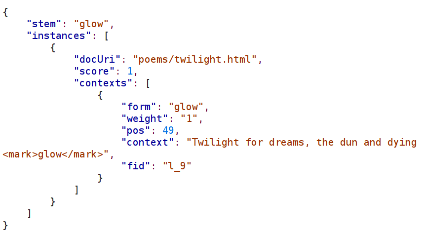

# How staticSearch works

staticSearch has two main features:

1. A stemming text-search engine with wildcard and keyword-in-context support
1. A range of filter types to constrain search results based on document type, date, and so on.

There is one stipulation: the input document collection must consist of well-formed HTML5 in the XHTML namespace. Well-formedness is essential because we use Saxon to process the collection; the XHTML namespace arises purely out of our own prejudice. One of the documents must be a page which will be converted into the search page; this can take any form as long as it contains a single <code>&lt;div&gt;</code> element with the id "staticSearch".

The user supplies an XML configuration file which tells the staticSearch build process where to find the documents and the search page, and allows you to set various options such as the number and length of keyword-in-context fragments to harvest for each stem. They may also choose to insert specially-crafted HTML meta tags into the headers of their documents to enable staticSearch to create a range of different filter controls on the search page.

The build process, shown in the diagram below, runs the following steps:

1. Checks and validates the input document collection.
1. Checks the user's configuration file, and if it is valid, uses it to build an XSLT configuration file for the remaining processes.
1. Processes all documents in the collection to create versions in which stemmed tokens are tagged, and each tagged token has additional information about its context (more on this later). Each document is given an identifier consisting of its path relative to the search page.
1. Uses the tokenized texts to build a collection of JSON files which are used to power the search.
1. Creates the search page itself.
1. Creates a report on the process.

{width=80%}

## The text search
This process amounts to building a rich index of the terms and metadata in the documents, but the index is fragmented across a huge collection of individual files, because each unique stemmed term has a JSON file to itself, named for itself ('book.json', 'walk.json', etc.); these are referred to as the "stem files". This means that when the search page queries the index, it need only retrieve the individual JSON files for the terms which are in the search; the bulk of the index is never retrieved. A stem file looks like this:

{width=80%}

This contains an entry for each document which contains the stem, an overall score for that stem in that document, and precise information about each individual instance, including a keyword-in-context extract in which it is marked.

In addition to the stem files, the build process also creates the following individual JSON files:

ssTitles.json 
This maps each document's unique identifier (its path relative to the search page) to its title. It may also include an icon with which to identify the document in search results, and an optional sort key to be used instead of its title when search results with the same score are being listed.

ssWordString.json
This is a plain-text list of all the individual (unstemmed) words appearing in the collection, separated by pipes:

...|page||pairs||paragraph||part||parts||peep||People||per||percent||percentages||perhaps|...

This file is used when processing wildcard searches. When the user enters a wildcard term, it is expanded into a regular expression which is used to extract all of the individual matching words from the word string JSON list. Each of those words is a potential match, so it is stemmed, and its stem file is retrieved. Then a search is made through all the contexts in those files to find matches for the wildcard/regex term in their contexts, so that all actual hits can be found.

For exact phrase (i.e. quoted string) searches, the quoted string is tokenized and the first non-stopword is extracted from it; that word is stemmed, and its stem file retrieved. Then all the contexts in that stem file are searched for an exact match for the phrase.

## The search filters

In addition to the text search, the user can trigger the creation of a range of different search filter controls on the search page, by including some HTML meta tags with specific formats in the document. For example, if a document has these three meta tags:

    <meta name="Document type" class="staticSearch_desc" content="Poems"/>
    <meta name="Document type" class="staticSearch_desc" content="Translations"/>
    <meta name="Date of publication"
 class="staticSearch_date" content="1895-01-05"/>
 
then the containing document will be classified as belonging to two document categories, "Poems" and "Translations", in the "Document type" selection filter (which we refer to as a "description filter"). A second date range filter will also be created. If an end-user searches for documents in either of those categories, using a date-range that includes 1895-01-05, then this document will be selected. Other filter types include boolean, number range, and "feature filters", which provide a typeahead searchable list of keywords. The build process creates a separate JSON file for each of these filters. The JSON for a description filter looks like this (heavily truncated example):

{width=80%}

When an end-user's search makes use of a filter control, then required filter JSON will also be downloaded along with any stem files needed, but the filter files are also downloaded in the background on page load so that most are already available by the time a user has initiated a search.

When filters are combined with text search, the list of documents containing hits for the text search are first computed, then those hits are filtered based on the filter settings. The small size and innate compressibility of the JSON files enables staticSearch to produce results quite rapidly, even from relatively large document collections.

