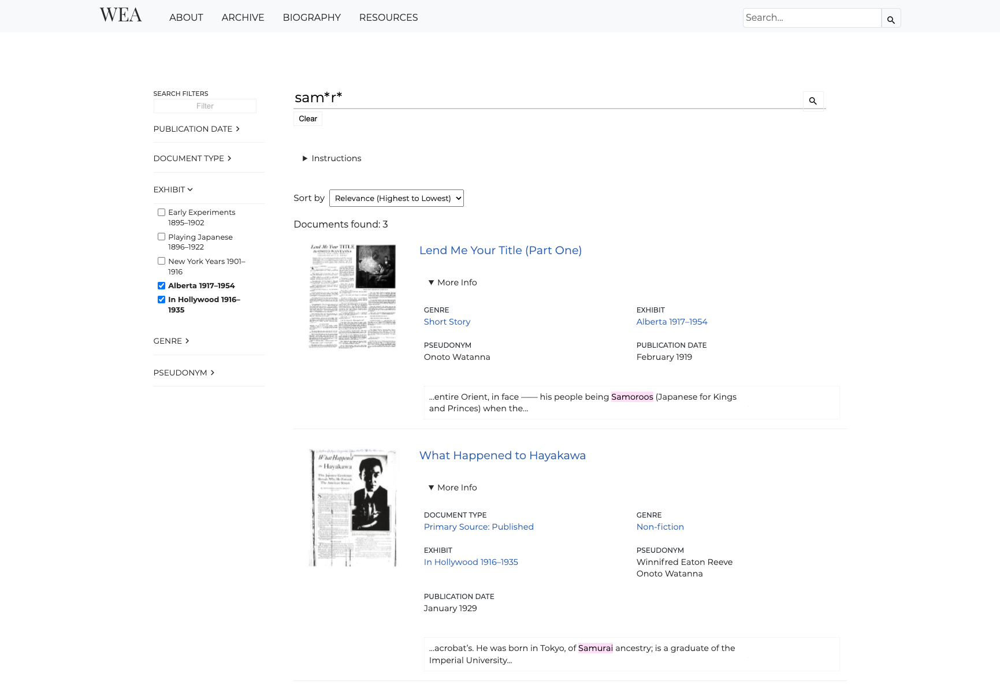

## Appendix

### Statistics

The following table details statistics about staticSearch's indexing process for three different projects: the very small staticSearch test set of documents; the *Winnifred Eaton Archive*'s (@Chapman2022) documents, including transcriptions; and the *Landscapes of Injustice*'s (@Stanger-Ross2021) large archive of primary and secondary source materials. Statistics below were taken on a Apple MacBook Pro running 16GB of RAM and silicon architecture (M1 Pro); timing and sizes are as reported by `gtime`, a port of GNU `time` for macOS.

| **Project**                        | **staticSearch Test Set** | **Winnifred Eaton Archive** | **Landscapes of Injustice** |
| ---------------------------------- | ------------------------- | --------------------------- | --------------------------- |
| **Number of HTML files tokenized** | 10                        | 1820                        | 93998                       |
| **Size of Document Collection**    | 17.4 KB                   | 31M                         | 264M                        |
| **Average document size**          | 1.8K                      | 17K                         | 2.9K                        |
| **Number of token files**          | 678                       | 20514                       | 92203                       |
| **Total Size (uncompressed)**      | 285K                      | 188M                        | 617M                        |
| **Average size (uncompressed)**    | 420B                      | 9.2K                        | 6.7K                        |
| **Total Size (compressed)**        | 171K                      | 39M                         | 106M                        |
| **Average size (compressed)**      | 252B                      | 1.9K                        | 1.2K                        |
| **Build time**                     | 6s 680ms                  | 1m 24s 52ms                 | 8m 53s 20ms                 |
| **Memory Used**                    | 391M                      | 1.3G                        | 3.7G                        |

###  Sample Static Search Implementations

Image from the Colonial Despatches project: https://bcgenesis.uvic.ca/search.html?q=%22timber%20trade%22

Image from *Le Mariage Sous le Ancien Regime*: https://mariage.uvic.ca/recherche.html?q=chat

Image from *Landscapes of Injustice*: https://loi.uvic.ca/archive/loiCollectionCustodianCaseFiles_search.html?Nationality=Canadian%20born&Date%20of%20Birth_from=1880&Date%20of%20Birth_to=1910

Image from *The Winnifred Eaton Archive*: https://winnifredeatonarchive.org/search.html?q=sam*r*&Exhibit=Alberta%201917%E2%80%931954&Exhibit=In%20Hollywood%201916%E2%80%931935
