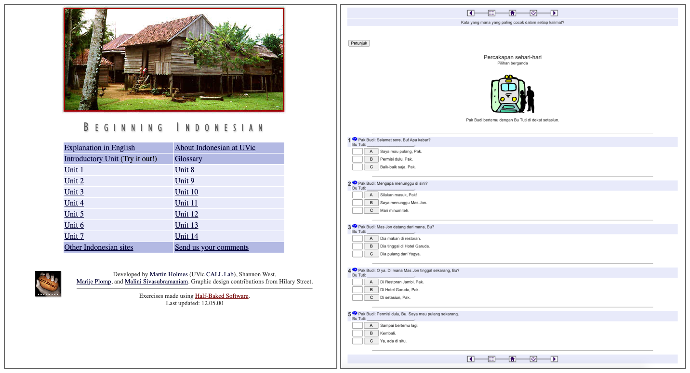

## 2. Early Days

What is now the Humanities Computing and Media Centre (HCMC) at the University of Victoria was once simply the Language Centre, a unit whose role was to maintain language laboratories and computer workstations and to write software applications used for language teaching courses. We had both Macintosh and Windows workstations, and would typically write custom software for either platform but not both, since writing cross-platform software applications was quite difficult in the days before the World Wide Web (WWW) and Java. When the Web first appeared, we seized on it enthusiastically as a practical way to provide language-teaching resources which could be delivered not only on both kinds of workstation in our labs but also to other locations. When JavaScript emerged around 1996, we were blessed with the capability to create truly interactive programmed teaching exercises, and by the turn of the millenium we had built language-teaching exercise collections for many languages, as well as desktop authoring tools to make the creation of such pages easy for non-coders (Arneil and Holmes 1998, 1999 and 2001).

The materials we created during this period still exist, and they still work perfectly. Examples can be seen in the Indonesian course materials created in 1999 (https://web.uvic.ca/hrd/indonesian/) and the endearingly-dated-looking “Web Language” online presentation (Holmes 1997), originally created in 1997 and last updated in 1999. The latter includes a feedback form which is still regularly used, so it still clearly has some relevance despite its appearance. The HTML and JavaScript is still fully functional, although non-standards-based cutting-edge technologies of the time, such as RealAudio, of course no longer work.

{#id .class width=80% height=auto}

In the early 2000s, the Language Centre was transformed into the Humanities Computing and Media Centre, and given a wider mandate to support what was then commonly termed Humanities Computing, now Digital Humanities. Better-funded projects came along, and more ambitious coding was undertaken, supporting not only language-teaching resources but also digital edition projects, historical datasets, mapping initiatives, and many other research and teaching activities. In particular, we developed some expertise in TEI and the XML-related languages, and began to create large online document collections such as the _Colonial Despatches_ project (https://bcgenesis.uvic.ca/) and _Le Mariage sous l'Ancien Régime_ (https://mariage.uvic.ca/). In place of static (albeit interactive) web pages, we started to build more sophisticated web applications based on PHP/MySQL database stacks and the eXist XML database.^[[url](https://www.exist-db.org/exist/apps/homepage/index.html)] Now blessed with our own server infrastructure thanks to the ground-breaking Canadian TaPOR (Text-Analysis Portal) initiative, we were able to run Tomcat, Cocoon, Postgresql, and a host of other backends to support the growing variety of DH projects under way at our institution.

These server-side systems enabled us (along with the rest of the DH community) to build resources which were more coherent and easier to maintain; information about a single entity, individual, or place could be encoded or stored in a single record, but retrieved and displayed in a multitude of contexts wherever it was needed. Documents could be transcribed and encoded once, but decorated, rendered, and displayed in many different ways based on the needs of the user or the application context. Sophisticated searching, grouping, and presentation options were easy to implement. Beginning in 2003 we generated a large number of these projects; our servers were well-populated and their CPUs were busy running XQuery, XSLT, PHP, SQL, and even ASP code.

As Lou Burnard (2016) remarks, “nothing in digital form is ever really finished.” DH projects may languish untended and unloved for periods of time, but their progenitors typically intend to continue working on them periodically or when funding allows. Setting up such projects implies a commitment to maintaining them, and as our project portfolio burgeoned, so did our maintenance burden. As we moved into the 2010s and onwards, a clear pattern began to emerge: projects created in the 1990s continued to work as intended with virtually no maintenance at all, but the projects we had built on sophisticated backend systems such as MySQL and eXist required frequent and time-consuming maintenance work. As an example, the _Robert Graves Diary_ (https://graves.uvic.ca/), one of our earliest digital edition projects, was originally written based on eXist version 0.9 in 2003–2004; it had to be steadily revised throughout 2005–2007, and then completely rewritten for eXist 1.4 in 2012, because the original Tomcat/Cocoon/eXist 0.9 stack became obsolete. Then in 2014 it had to be updated again. This was a project on which the core academic work had been completed in the first phase of the project, but due to infrastructure churn it regularly returned to haunt us. Over the years, we amassed a maintenance burden which threatened to overwhelm our ability to support new projects coming through our doors.

This problem was the impetus for Project Endings. The Web had solved for us the challenge to “write once, run anywhere”;^[[url](https://en.wikipedia.org/wiki/Write_once,_run_anywhere)] the issue we were now addressing was how to “write once, run forever.” Project Endings brought together a team consisting of academic digital humanists, programmers, and librarians, along with a selection of active, complex digital edition projects, to determine how we could best plan, execute, and archive our projects in such a way that they would live on indefinitely without further maintenance. 

