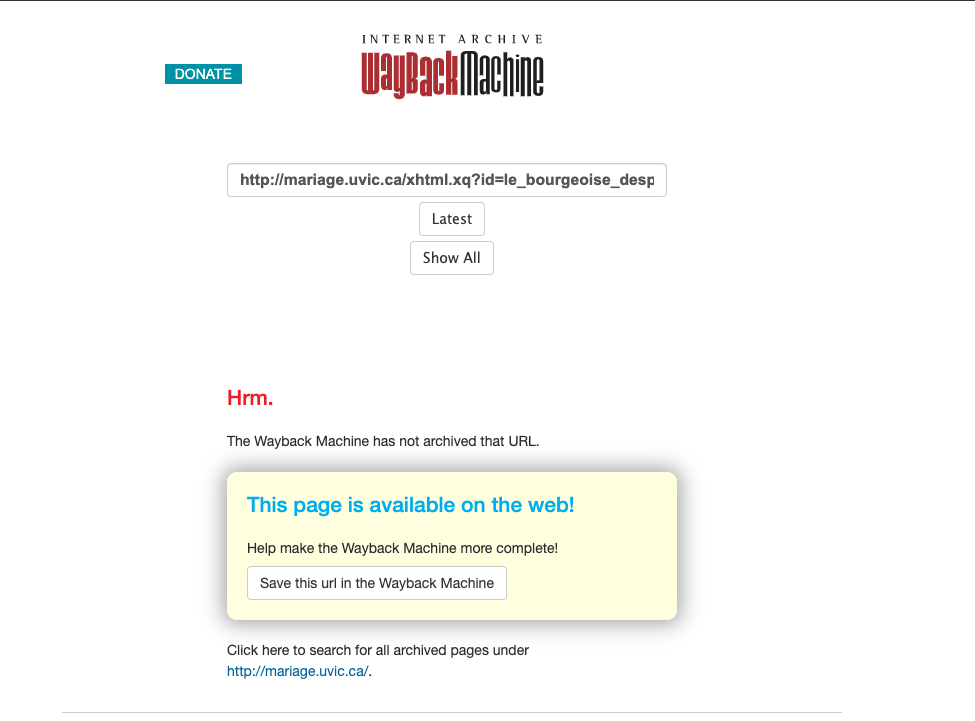

<!--A litany of failures: all the things that we did wrong. E.g. query-string URLs causing failure to archive; content only linked through JS (for instance) that did not get harvested; inconsistent state of live applications; ...-->

## 3. A Catalogue of Failures

In the early days of the Endings project, we began to examine in detail how our older digital editions and sites had progressively broken down. Some problems were obvious: obsolete versions of server-side applications and services (MapServer, MySQL, PHP) had been retired or replaced, and old code would not run on new versions, even if new versions existed. Other failures were more subtle. We investigated, for example, how successfully our applications had been archived by The Internet Archive (https://archive.org/) and reproduced on the Wayback Machine (https://archive.org/web/). It was immediately obvious that sites built on backend databases, where “pages” were in fact queries to the database, were very problematic. The project _Le Mariage sous l'Ancien Régime_, which linked to its anthology documents with URLs like this:

`http://mariage.uvic.ca/xhtml.xq?id=le_bourgeoise_desprit`

was scarcely archived at all, presumably because the archive crawler was unable to follow or parse the query-based links successfully, so for the most part, the archived versions of the site consist mainly of notices that “The Wayback Machine has not archived that URL.” 

{#id .class width=80% height=auto}

*Mariage* also had a rather gratuitous feature whereby the end user could choose between three available colour schemes, and because that functionality relied entirely on JavaScript, the required CSS files had been retrieved and stored as though they were HTML pages, and no styling appeared on the site pages at all. Site search engines of course failed completely, as did any annotation popups linked from texts which relied on retrieving data by querying the backend database, and JavaScript-based interactivity was generally broken. In fact, the majority of our large-scale, high-profile digital edition projects were scarcely functional at all in the Wayback Machine, and most of their content had not even been retrieved and stored. 

The Internet Archive had never been one of our primary backup strategies, but it was disappointing to discover how unsuccessful it had been in its attempts to crawl and reproduce our sites. Although some of these failures could perhaps be laid at the door of the Internet Archive crawler, Heritrix, which had some limitations, most of them were clearly our fault, and resulted from our crude approach to URL construction. One site, the _Robert Graves Diary_, was represented by only a handful of static pages, since the majority of its content was designed to be accessed through explicit searches from the home page, with the search parameters encoded in URL query strings; the crawler would have had no way to know what pages existed on the site other than the few information and background pages linked directly from the home page. On the live versions of these sites, any pages accessed by a user were typically constructed on the fly by XQuery and XSLT, so they did not exist in any form which could be backed up even locally by any normal method. 

Digging deeper into methods for backing up and replicating our projects within our own institution revealed other problems. Some sites and applications included hard-coded links to local resources using absolute URLs rather than relative ones, so if the site were replicated in a different location, it would still be dependent on, and prone to send the user over to, the original site. 

Another problem faced by projects backed by online databases was a lack of consistency in versioning of content. Typically, multiple project members had rights to upload new material directly into the live database, thus “publishing” it, but there was no attempt to ensure that the current state of the live site was—in Endings parlance—coherent, consistent, and complete (see Holmes and Takeda 2019b). Someone editing a primary source text might upload a new chapter to the site, forgetting that it contained links to newly-added people in the personography or locations in the placeography which also needed to be uploaded, so those links would fail. Every “page” might have a different publication date, and the site overall had no version or edition information, so anyone citing it would be forced to fall back on the rather unfortunate “last accessed” date to anchor their citation, knowing that the specific version of the document they were citing might change tomorrow with no warning and no way to retrieve the previous version. This was a problem of project organization rather than a technical issue, and it arose largely out of the working methods emerging in the early 2000s. In the excitement provoked by the new affordances and publication possibilities inherent in digital projects, there was a tendency to publish anything and everything as quickly as possible. A measured and thoughtful approach to “rolling publication” is of course possible, but, as we discuss in section 5.5, our work on Endings has convinced us that for most projects, a more traditional edition-based methodology is better.

Finally, we were forced to acknowledge that few of our projects had adequate documentation, making remediation and reconstruction doubly difficult.

We had, it seemed, spent a dozen years enthusiastically generating fragile, unmanageable, unmaintainable, unarchivable contraptions, and we were going to pay the price for our thoughtlessness.

This is not an unusual situation. In fact, our research suggests that it is the norm for DH projects.^[In our Endings survey, for example, 31% of projects used a MySQL database, 15% used Drupal, and 18% used WordPress; others depended on Ruby/Rails, Django, Omeka, Plone, Cocoon, and eXist.] Many DH web applications are built rapidly, using off-the-shelf frameworks and libraries which date quickly and are ultimately guaranteed to fail, and most projects either rebuild their applications in repeated cycles of funding, or see them languish and ultimately disappear. Our situation was perhaps more pointed and critical because we are a base-funded unit with a long lifetime, committed to maintaining our projects even after their initial funding is exhausted. Units like ours are still relatively rare; in most cases, there is little or no institutional help and no expectation of any. But having caused the problem, we now had to fix it, not just by rebuilding multiple large projects, but by doing so in such a way that we would not have to do the same work again in another ten years.

