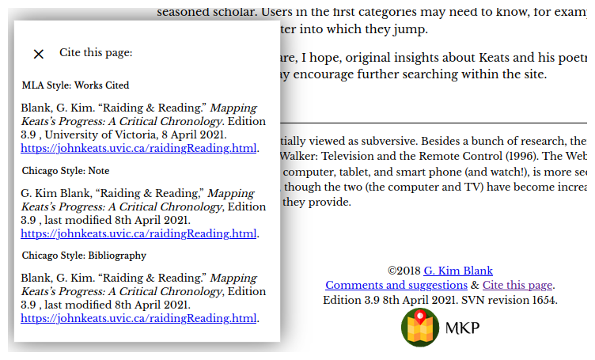

### 5.5 Release Management 

Without good release management, then, a project can never end gracefully; it can only falter and die. 

These principles apply to release management:

#### Releases should be periodical and carefully planned. The “rolling release” model should be avoided.

In the world of traditional print scholarship, a publication was a coherent singular object, released on a particular day in a particular place, and provided with a convenient edition number which enabled scholars to cite it without ambiguity.^[This is not strictly true, of course—minor typographical variants are common within a single edition—but for most practical purposes we behave as though it is.] However, many digital edition projects have adopted a "rolling release" approach modelled on the predominant approach to software publication, where corrections and new features are steadily made to a mutable product. As we have argued above, this makes it difficult to maintain consistency, coherence and completeness, and makes citation problematic. Also, since most large projects go through moribund phases in which work largely stops, and will most likely end in a similar way, it is essential that whatever is the current released state (edition) of a project constitutes an acceptable version for the long term.

#### A release should only be made when the entire product set is coherent, consistent and complete (passing all validation and diagnostic tests).

The irreversible nature of print publication means that prior to publication, an edition is typically subjected to intense and minute scrutiny in an effort to exclude all errata. Because digital material is much easier to remediate, it is not so common for the same level of diligent inspection to be applied to digital editions, despite the fact that much of this scrutiny can be automated. In Holmes and Takeda 2019b, we describe three distinct levels of diagnostic checks which can be incorporated into a project build process to provide mechanical proof that no links are broken, no content is missing, and all planned content and features are complete. This approach, combined with the detailed proofreading we would expect to apply to any scholarly publication prior to release, will minimize flaws in the released edition.

#### Like editions of print works, each release of a web resource should be clearly identified on every page by its build date and some kind of version number.

Just like print editions, digital resources should carry a clear edition number which applies throughout the resource to every part of it. Our normal practice is to include this information in the footer of every page. At the time of writing, for example, the current version of The Map of Early Modern London carries this information in its footer:

MoEML v.6.5, svn rev. 17540 2020-09-15 12:35:49 -0700 (Tue, 15 Sep 2020). 

This includes not only the specific edition number (6.5), but also the Subversion repository revision from which it was built, along with the exact date and time of that revision.^:[Including the version control information also makes it possible to rebuild this edition exactly as it is, if data is lost or corrupted.]

#### Web resources should include detailed instructions for citation, so that end-users can unambiguously cite a specific page from a specific edition.

Citation patterns for web-based resources are still subject to some confusion and change, so we recommend that projects make things easier for other scholars by providing copy/pastable citation blocks for each individual page, accessible from a link on the page. The example in Figure X comes from the _Mapping Keats’s Progress_ project.

{#id .class width=80% height=auto}

