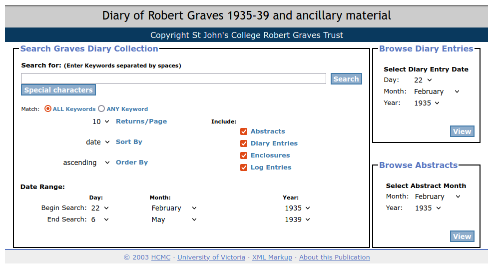

## 6. The Lingering Problem: Search

With these Principles in place, we were able to convert the dormant projects, such as _The Robert Graves Diary_, and the on-going projects, like *The Map of Early Modern London*, from unwieldy eXist applications into a large bundle of static HTML, CSS, and JS. Our goal for these static incarnations was that they looked and functioned identically to the live application and, as these sites were steadily released and tested, we were happy to find that doing so was not only feasible, but significantly improved the projects. Our staticization of _Graves_, for instance, surfaced various encoding errors that had gone unnoticed for many years, which we could now easily diagnose and fix. And in moving from a dynamic application to the static site, we had the opportunity to re-write the codebase from scratch, removing the layers of obsolete code that had sedimented within the codebase over its long history of updates, maintenance and modernization of the CSS and JavaScript. Projects in active development benefitted similarly; these re-writes provided a good opportunity to scrutinize the project, lopping off irrelevant or deprecated code.  Thanks to our Jenkins Continuous Integration server, following any change to the source data or the processing, we no longer needed to click anxiously around the site to confirm that we hadn't broken the anything: any encoder could simply commit, wait a few minutes, and then, so long as the Jenkins server didn't send its “BUILD FAILED” message,  proof their changes in the context of the site. 

But these sites all lacked a significant and crucial part of their functionality: search. Most digital editions require some form of text-based searching and, in many cases, the ability to search across a large and disparate document collection and aggregate documents based on multiple metrics is the project's raison d'être. Search was, in other words, non-negotiable—we could not sacrifice the robust search mechanisms on the existing site. We could quietly ignore search for the time being in some projects, like *The Map Of Early Modern London*, where search was peripheral to the main functionality, but the _Robert Graves Diary_ forced us to come up with a real solution: the homepage for the project was essential one large, faceted search page, which we were able to replicate perfectly, but since search itself was handled entirely by eXist, the static version was rendered completely inert. 

We had always assumed that the kinds of search our projects required—complex faceting and filters, wildcards, and exact phrase queries split across multiple, collection specific search pages—was necessarily the stuff of servers and could not be made static. While some client-side search solutions were available, they were  ill-equipped to handle the thousands of documents, millions of words, and complex metadata structures that comprise a standard digital edition.^[Perhaps the best-known examples are FlexSearch, Lunr.js and Elasticlunr.js. None of the available alternatives provided the sophistication and scalability our sites needed.] Outsourcing indexing to an external service, like Elasticsearch, was out of the question as it would violate the core Endings principles. 

Our intermediate solution was to stick with what we knew: package the static sites into a XAR bundle and spin up a simple eXist instance whose only job would be to index, query, and retrieve the search results from the static HTML pages. Of course, this worked perfectly and we released the first version of a number of our static sites following this approach. It was a disappointing compromise. We had gone through the trouble of re-writing these sites in their entirety to remove the fragility inherent in their dependency on eXist, and had celebrated our success in building completely static, serverless websites, and now here we were, returning to eXist, hat in hand. 

If we were to to return to eXist, we reckoned, then we should at least try to improve the situation; in the spirit of LOCKSS and following our principle for “Graceful Failure,” we decided to take a decidedly maximalist approach. Using _Graves_ as our case-study, we supplemented eXist with three distinct approaches, which all had their own limitations with respect to functionality, archiving, and sustainability, but could provide something of a safety net for the project.  We discuss these approach in greater detail in Holmes and Takeda 2018, but, in brief, those three approaches were: 1) a Google search widget, which would not offer anything beyond what Google already provides, but at least gave users a shortcut for a site-specific search; 2) an experimental interface for querying a Solr index provided by the Library (the eventual archival home for all of these projects), which could provide many of the faceting and filtering structures required by the project; and 3) a “standalone search,”  a Javascript-only client-side text search interface that would stem user input, match it against an pre-built inverted index generated during the build process. In this process, a list of distinct words was created for each document; the words were then run through the Python implementation of the Porter Stemmer, and then documents were grouped by stem, so that JavaScript could return a simple list of the documents in which that stem appeared. This  solution, as we noted then, worked well for small document collections, but lacked the necessary features—keyword-in-context, search faceting, and filtering— and thus should be considered the “ultimate fallback when all else fails” (59).

Over the last three years, we have continued to improve and expand what we then called “standalone search” into “staticSearch”: a fully-featured and sustainable search engine for static websites that has no server side dependencies. Now implemented by nearly a dozen projects, staticSearch has not only allowed us to replicate  server-side search functionality, but has significantly expanded what these searches can do. So to revise our answer to the question from our 2018 paper, “Why do I need four search engines?”: You don't.  

### 6.1 How staticSearch works

Simple client-side search engines such as Lunr.js work by generating a large index file, which is then downloaded to the client, and queried by JavaScript in the search. Obviously, the larger a document collection, the larger the index, and any site consisting of more than a few dozen pages will rapidly outgrow this approach. The key insight which enabled us to create staticSearch was the idea that the search page need only download those components of the index it actually requires to respond to a specific query. Instead of a single large index, we create thousands of individual JSON files, one for each stemmed term, and the text search component of the search page simply stems all the search terms and retrieves only the specific JSON files for each of those terms. This enables rapid query response even for large sites.

Of course, text search alone is not enough; search facets such as topic, document type, date range, and other metadata-based filters are a fundamental requirement for searching digital editions and other rich document collections. One by one, we have added support for a range of these features, which can be configured by the addition of HTML <meta> elements with specific patterns to site pages. The staticSearch indexing process works its way through the HTML pages of a site indexing the text but also searching for these <meta> elements, building a collection of distinct JSON files which the search page can retrieve as needed to respond to queries and filter results.

Holmes and Takeda 2020 provides a more detailed explanation of how staticSearch works, and the full documentation for the current release is available on the Project Endings website.^[https://endings.uvic.ca/staticSearch/docs/index.html.]

